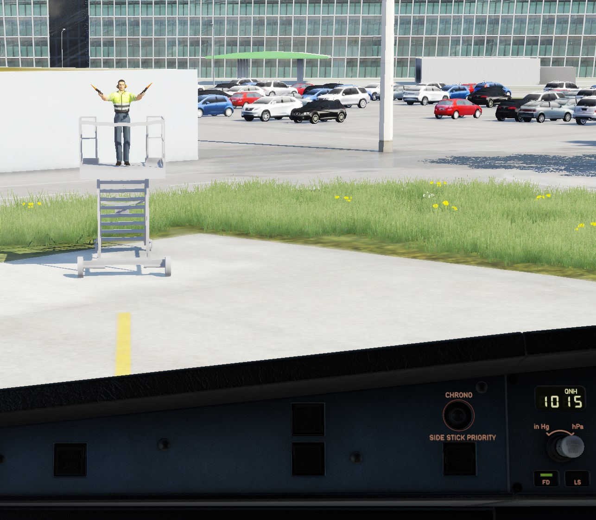
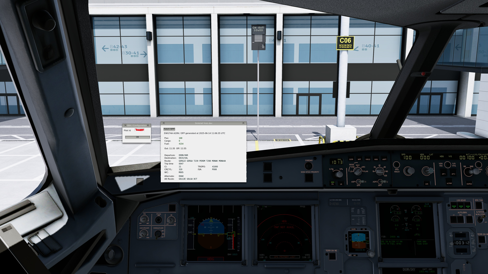
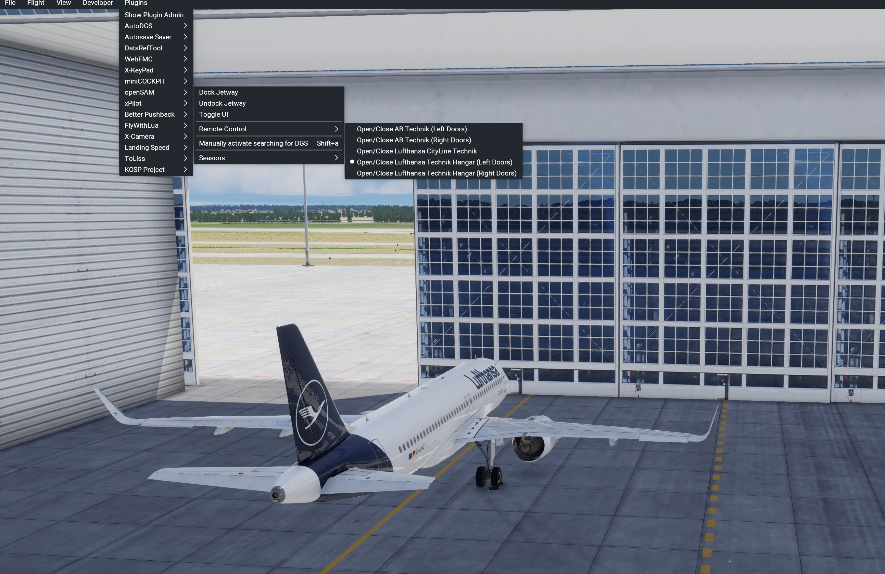
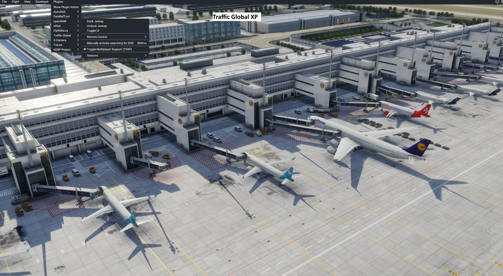

# openSAM plugin for X-Plane
An open source implementation of SAM that drives jetways and provides VDGS and Marshaller service.

**If you are happy with SAM or use an add-on package for SAM like "SAM Ground Service" you can already stop reading here. Also if you have no idea what SAM is or SAM-Seasons are good for you probably won't need this plugin.**

This is a lightweight open source replacement for SAM's basic functionality: Jetway animation and VDGS and Marshaller guidance + custom animations.

It supports the multiplayer plugins *xPilot, Traffic Global XP and LiveTraffic* as well.

It is meant to be a drop in replacement for SAM, i.e. at startup it scans for SAM enabled sceneries and uses the original configuration files.
### Jetways

### DGS
 
### Simbrief integration
Requires the simbrief_hub plugin (https://github.com/hotbso/simbrief_hub)

### Custom animations

### Multiplayer support
 

## Download
Download the latest (non-beta-)release here: https://github.com/hotbso/openSAM/releases/latest

You can see all releases including betas here: https://github.com/hotbso/openSAM/releases

After you've installed it once skunkcrafts updater will take care. Be sure you select the right channel PROD or BETA.

Download link for skunkcrafts updater:

https://forums.x-plane.org/index.php?/forums/topic/292710-skunkcrafts-updater-standalone-client/

Support Discord: https://discord.gg/BtDvKcUSEP

## Installation
- Remove the SAM plugin (but keep the embedded SAM_Library somewhere)
- If you already deleted SAM but use a SAM replacement library (e.g. "FlyAgi - SAM Fallback Library") remove it.
- If installed remove the "SAM Seasons emulator" plugin. Its functionality is included in openSAM.
- From within this zip install
    "openSAM_Library" into "Custom Scenery"
    "openSAM"         into "Resources/plugins"

Some sceneries (e.g. for Zero Dollar Payware, Taimodels) require the original SAM_Library
- If not already done link or copy the SAM_library into "Custom Scenery"
- Make sure openSAM_Library is above SAM_Library in scenery_packs.ini

## Usage
The openSAM plugin defines commands:
- "Dock jetway"   -> openSAM/dock_jwy
- "Undock jetway" -> openSAM/undock_jwy
- "Toggle UI"     -> openSAM/toggle_ui
- "Toggle jetway" -> openSAM/toggle_jwy

The first three commands are accessible through the menu as well.

openSAM augments XP12's standard command "sim/ground_ops/jetway":
- if there is a SAM jetway operate it
- otherwise try to operate a XP12 standard jetway (if there is none it's a noop)

In addition openSAM exports datarefs:
```
"opensam/jetway/number"
    number of jetways at stand
```
```
"opensam/jetway/status"
    0 = no jetway(s)
    1 = jetway(s) present, available for docking
    2 = docked
   -1 = can't dock or jetway(s) in transit
```
```
"opensam/jetway/door/status" array per door
    0 = no jetway docked at this door
    1 = jetway docked at this door
```
## Customize actions after docking / before undocking
openSAM calls optional commands "openSAM/post_dock" and "openSAM/pre_undock". \
See a sample in the lua directory for the ToLiss fleet and more examples in the contributed directory.

## Activation of DGS
After you LAND (= some air time!) on an airport the plugin activates and searches actively for
suitable stands in the direction that you are taxiing. Note that you MUST have your beacon on.
Once you come closer the VDGS or the Marshaller give appropriate guidance information.

If you just want to try out the feature without prior flight you must issue the
command "openSAM/activate", "Manually activate searching for DGS" through a binding or the menu.
Beacon on, of course!

That should look familiar to users of AutoDGS.

## Multiplayer support
openSAM supports
 - xPilot
 - Traffic Global XP
 - LiveTraffic

Set up your multiplayer environment as needed (e.g. connect to Vatsim and/or enable/disable MP plugins).\
Then select "Toggle Multiplayer Support" in openSAM's menu.\
If xPilot is connected to Vatsim that takes precedence over other installed multplayer plugins.\
The menu text of "Toggle Multiplayer Support" shows which personality is enabled.

**Note**\
xPilot and liveTraffic receive aircraft positions from other sceneries / simulators or the real world and these
may not match up with your installed scenery. Your mileage will vary.

TGXP gives the visually most pleasing rendition.

## The problem of a second door
Up to now there is no reliable way to determine the position of a second door.
Therefore door positions must be maintained in the config file "acf_door_position.txt".

To find the position proceed as follows:

Locate the "openSAM: plane loaded" line in Log.txt.

openSAM: plane loaded: B742, plane_cg_y: -2.44, plane_cg_z: 31.81, door 1: x: -2.93, y: 1.77, z: -22.45

Use these values as a starting point: door 2 is somewhat behind meaning z towards the tail and the
correct line to enter in "acf_door_position.txt" is:

B742 2 -2.93 1.77 -14.40

Please share results so they can be included in future updates.

# Support for Scenery builders
## Zero configuration Marshaller and VDGS service
This is for sceneries with no or XP12 default jetways that should be equipped with Marshallers or VDGS.
In WED just place the appropriate assets from 'openSAM' in the library pane into the scenery.
SAM_Library is not required.
Then copy file "openSAM_Library/zero_config_dgs/sam.xml" into your scenery and you are done.

## Zero configuration SAM library jetways" for scenery creators
In case XP12 default jetways are not sufficient SAM library jetways can be used with zero configuration. \
SAM_Library in required. \
Just place them with proper initial orientation of the tunnel in WED. At runtime the cabin will point
perpendicular to the stand with slight randown variations. \
Use of SAM's authoring tool is not necessary. \
Then copy file "openSAM_Library/zero_config_dgs/sam.xml" into your scenery and you are done.

# Credits
[Jonathan Harris (aka Marginal)](https://github.com/Marginal) for creating Autogate\
[cxn0026](https://forums.x-plane.org/profile/121130-cxn0026) for explaining how Marshallers and VDGS really use guidance signals\
[Papickx](https://forums.x-plane.org/profile/823983-papickx/) + @cxn0026 for providing better textures and day + night lighting\
[zodiac1214 (aka cfanap)](https://github.com/zodiac1214) for creating the automated build and release system including skunkcrafts support\
[TwinFan](https://github.com/TwinFan) for providing LTAPI\
[X-Codr](https://www.x-codrdesigns.com/) for performance improvements\
[Pierre](https://github.com/pierr3) for reworking the VDGS model and giving it much more precision and details

## License
Please observe that this material is covered by various licenses.

### The objects and textures and source code of Autogate by Marginal:
-- copy of license remark from https://github.com/Marginal/AutoGate ---
```
The plugin code in the src directory is licensed under the GNU LGPL v2.1 license.\
The rest of the kit is licensed under the Creative Commons Attribution license. In short, you can use any part of this kit (including the 3D objects and their textures) in original or modified form in a free or commerical scenery package, but you must give the author credit.
```
### The alerting sound for jetways:
pixabay.com "8 royalty-free reverse-beep sound effects"\
https://pixabay.com/sound-effects/backing-up-beepwav-14889/


### LTAPI code
```
/// @author     Birger Hoppe
/// @copyright  (c) 2019-2025 Birger Hoppe
/// @copyright  Permission is hereby granted, free of charge, to any person obtaining a
///             copy of this software and associated documentation files (the "Software"),
///             to deal in the Software without restriction, including without limitation
///             the rights to use, copy, modify, merge, publish, distribute, sublicense,
///             and/or sell copies of the Software, and to permit persons to whom the
///             Software is furnished to do so, subject to the following conditions:\n
///             The above copyright notice and this permission notice shall be included in
///             all copies or substantial portions of the Software.\n
///             THE SOFTWARE IS PROVIDED "AS IS", WITHOUT WARRANTY OF ANY KIND, EXPRESS OR
///             IMPLIED, INCLUDING BUT NOT LIMITED TO THE WARRANTIES OF MERCHANTABILITY,
///             FITNESS FOR A PARTICULAR PURPOSE AND NONINFRINGEMENT. IN NO EVENT SHALL THE
///             AUTHORS OR COPYRIGHT HOLDERS BE LIABLE FOR ANY CLAIM, DAMAGES OR OTHER
///             LIABILITY, WHETHER IN AN ACTION OF CONTRACT, TORT OR OTHERWISE, ARISING FROM,
///             OUT OF OR IN CONNECTION WITH THE SOFTWARE OR THE USE OR OTHER DEALINGS IN
///             THE SOFTWARE.
```

### Contributions by hotbso:
This is in part a derived work from Autogate so the above mentioned licenses apply accordingly to the components of this project.

### Home on x-plane.org
https://forums.x-plane.org/index.php?/files/file/90865-opensam-an-open-source-replacement-for-sam-on-xp12/

## Build

### Github actions
Pushing a tag starting with letter "v" does everything for you.

### Windows
The build process is performed on msys2 with the mingw64 personality.\
Install expat with "pacman -S expat"

For the XP11 version a linkable OpenAL32.dll was obtained as follows:
- get copy of libOpenAL32.dll e.g. from XP11's dll folder
- pick libOpenAL's *include/AL* header files, e.g. from the msys2 system
- run within a msys2 shell:
```
gendef OpenAL32.dll
dlltool -d OpenAL32.def -D OpenAL32.dll -k -a -l libopenal32.a -v
```
```
make -f Makefile.mgw64
```

### Linux
```
make -f Makefile.lin64
```
### macOS on Linux
The build process is performed on Linux with an osxcross environment.\
Install expat, -arm64 installs universal libraries. "-s" install static libraries only.
```
export MACOSX_DEPLOYMENT_TARGET=12.0
omp install -s -arm64 expat

make -f Makefile.mac64
```

### macOS on macOS
```
port install expat +universal\
make -f Makefile.mac64
```
