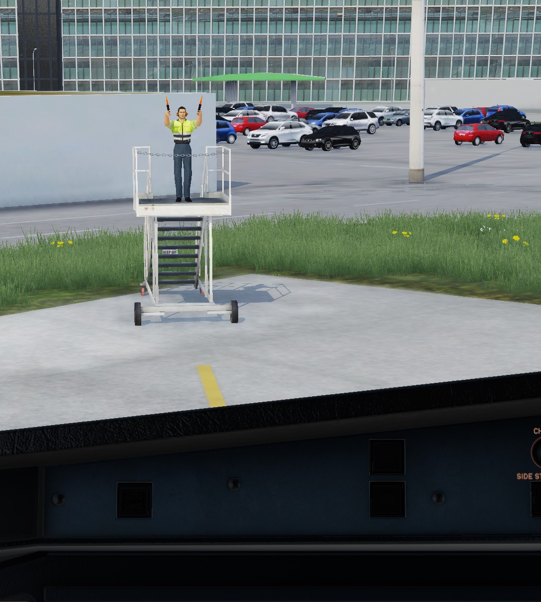

# openSAM
An open source implementation of SAM that drives jetways and provides VDGS and Marshaller service.

**If you are happy with SAM or use an add-on package for SAM like "SAM Ground Service" you can already stop reading here. Also if you have no idea what SAM is or SAM-Seasons are good for you probably won't need this plugin.**

This is a lightweight open source replacement for SAM's basic functionality: Jetway animation and VDGS and Marshaller guidance + custom animations.

It supports the multiplayer plugins *xPilot, Traffic Global XP and LiveTraffic* as well.

It is meant to be a drop in replacement for SAM, i.e. at startup it scans for SAM enabled sceneries and uses the original configuration files.
   

## Download
Download the latest (non-beta-)release here: https://github.com/hotbso/openSAM/releases/latest

You can see all releases including betas here: https://github.com/hotbso/openSAM/releases

After you've installed it once skunkcrafts updater will take care. Be sure you select the right channel PROD or BETA.

Download link for skunkcrafts updater:

https://forums.x-plane.org/index.php?/forums/topic/292710-skunkcrafts-updater-standalone-client/

Support Discord: https://discord.gg/b2CtsG6fZ6## Installation

## Installation
- Remove the SAM plugin (but keep the embedded SAM_Library somewhere)
- If you already deleted SAM but use a SAM replacement library (e.g. "FlyAgi - SAM Fallback Library") remove it.
- If installed remove the "SAM Seasons emulator" plugin. Its functionality is included in openSAM.
- From within this zip install
    "openSAM_Library" into "Custom Scenery"
    "openSAM"         into "Resources/plugins"

Some sceneries (e.g. for Zero Dollar Payware, Taimodels) require the original SAM_Library
- If not already done link or copy the SAM_library into "Custom Scenery"
- Make sure openSAM_Library is above SAM_Library in scenery_packs.ini

**Be sure you read the 00_README.TXT file.**


# Credits
Jonathan Harris (aka Marginal) (https://github.com/Marginal) for creating Autogate\
@Papickx + @cxn0026 for providing better textures and day + night lighting \
@zodiac1214 (aka cfanap) (https://github.com/zodiac1214) for creating the automated build and release system including skunkcrafts support\
@twinfan (https://github.com/TwinFan) for providing LTAPI

## License
Please observe that this material is covered by various licenses.

### The objects and textures and source code of Autogate by Marginal:
-- copy of license remark from https://github.com/Marginal/AutoGate ---
```
The plugin code in the src directory is licensed under the GNU LGPL v2.1 license.\
The rest of the kit is licensed under the Creative Commons Attribution license. In short, you can use any part of this kit (including the 3D objects and their textures) in original or modified form in a free or commerical scenery package, but you must give the author credit.
```
### The alerting sound for jetways:
pixabay.com "8 royalty-free reverse-beep sound effects"\
https://pixabay.com/sound-effects/backing-up-beepwav-14889/


### LTAPI code
```
/// @author     Birger Hoppe
/// @copyright  (c) 2019-2025 Birger Hoppe
/// @copyright  Permission is hereby granted, free of charge, to any person obtaining a
///             copy of this software and associated documentation files (the "Software"),
///             to deal in the Software without restriction, including without limitation
///             the rights to use, copy, modify, merge, publish, distribute, sublicense,
///             and/or sell copies of the Software, and to permit persons to whom the
///             Software is furnished to do so, subject to the following conditions:\n
///             The above copyright notice and this permission notice shall be included in
///             all copies or substantial portions of the Software.\n
///             THE SOFTWARE IS PROVIDED "AS IS", WITHOUT WARRANTY OF ANY KIND, EXPRESS OR
///             IMPLIED, INCLUDING BUT NOT LIMITED TO THE WARRANTIES OF MERCHANTABILITY,
///             FITNESS FOR A PARTICULAR PURPOSE AND NONINFRINGEMENT. IN NO EVENT SHALL THE
///             AUTHORS OR COPYRIGHT HOLDERS BE LIABLE FOR ANY CLAIM, DAMAGES OR OTHER
///             LIABILITY, WHETHER IN AN ACTION OF CONTRACT, TORT OR OTHERWISE, ARISING FROM,
///             OUT OF OR IN CONNECTION WITH THE SOFTWARE OR THE USE OR OTHER DEALINGS IN
///             THE SOFTWARE.
```

### Contributions by hotbso:
This is in part a derived work from Autogate so the above mentioned licenses apply accordingly to the components of this project.

### Home on x-plane.org
https://forums.x-plane.org/index.php?/files/file/90865-opensam-an-open-source-replacement-for-sam-on-xp12/

## Build

### Github actions
Pushing a tag starting with letter "v" does everything for you.

### Windows
The build process is performed on msys2 with the mingw64 personality.\
Install expat with "pacman -S expat"

For the XP11 version a linkable OpenAL32.dll was obtained as follows:
- get copy of libOpenAL32.dll e.g. from XP11's dll folder
- pick libOpenAL's *include/AL* header files, e.g. from the msys2 system
- run within a msys2 shell:
```
gendef OpenAL32.dll
dlltool -d OpenAL32.def -D OpenAL32.dll -k -a -l libopenal32.a -v
```
```
make -f Makefile.mgw64
```

### Linux
```
make -f Makefile.lin64
```
### macOS on Linux
The build process is performed on Linux with an osxcross environment.\
Install expat, -arm64 installs universal libraries. "-s" install static libraries only.
```
export MACOSX_DEPLOYMENT_TARGET=12.0
omp install -s -arm64 expat

make -f Makefile.osxcross
```

### macOS on macOS
```
port install expat +universal\
make -f Makefile.mac64
```
